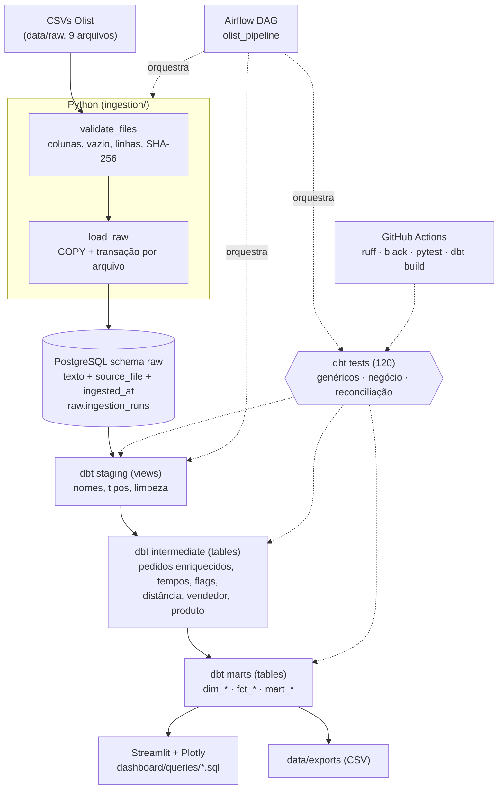

# Arquitetura

## Camadas

| Schema | Materialização | Papel |
|---|---|---|
| `raw` | tabelas (Python) | cópia fiel dos CSVs, tudo em `text`, mais `source_file` e `ingested_at`; `ingestion_runs` guarda o histórico de cargas |
| `staging` | view | um modelo por fonte: `snake_case`, tipos (`timestamp`, `numeric`), espaços removidos, texto vazio vira `NULL`, colunas de rastreabilidade |
| `intermediate` | tabela | regras de negócio: pedido enriquecido, métricas de tempo, flags, distância, base de vendedor e de produto |
| `marts` | tabela | dimensões, fatos e marts de negócio consumidos pelo dashboard |

## Marts

**Dimensões:** `dim_date`, `dim_customer`, `dim_product`, `dim_seller`, `dim_location`.
**Fatos:** `fct_orders` (pedido), `fct_order_items` (item), `fct_payments` (pagamento), `fct_reviews` (avaliação).
**Marts de negócio** (só medidas aditivas; razões são calculadas por quem consome, assim os filtros do dashboard continuam corretos):

| Mart | Grão |
|---|---|
| `mart_sales_daily` | dia × UF do cliente × status |
| `mart_delivery_performance` | mês × faixa de distância |
| `mart_regional_operations` | mês × UF do cliente |
| `mart_seller_performance` | vendedor × mês |
| `mart_product_performance` | produto × mês (agregue por categoria) |
| `mart_customer_experience` | mês × faixa de atraso × nota |

## Orquestração

`airflow/dags/olist_pipeline.py`: `check_files → validate_sources → load_raw → dbt_staging → dbt_intermediate → dbt_marts → dbt_tests → export_dashboard_data`. Retries 2, timeout 20 min por task, sem agenda (dataset histórico). `export_dashboard_data` só roda se `dbt test` passar. Detalhes e como subir: README.

## Execução local

Só o PostgreSQL roda no Docker (`compose.yaml`); Python, dbt e Streamlit rodam no venv do host. O Airflow é opcional (`docker compose --profile airflow`).
