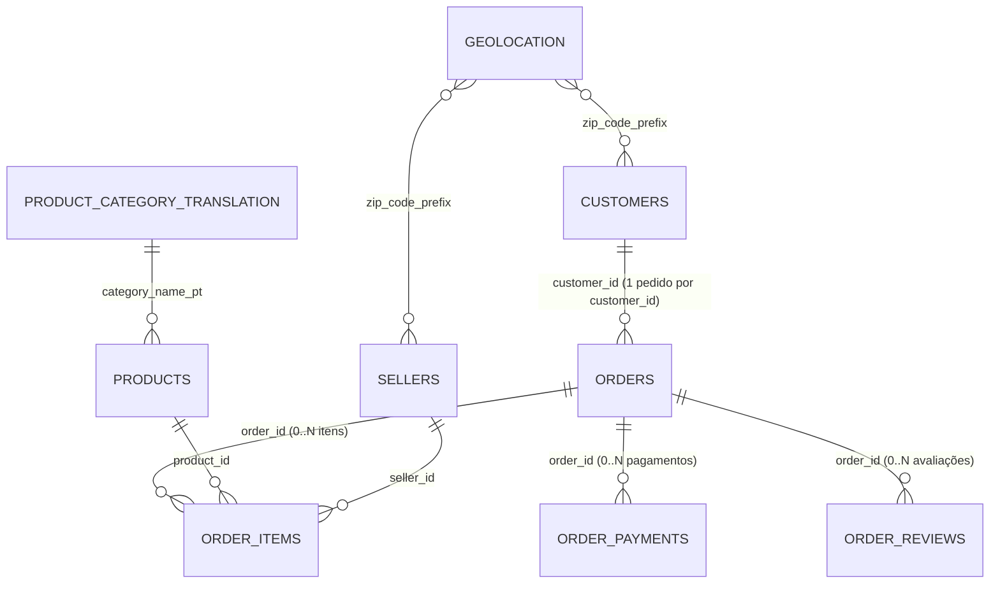

# Dicionário de dados

Fonte: [Olist no Kaggle](https://www.kaggle.com/datasets/olistbr/brazilian-ecommerce). Linhas = registros de dados (sem cabeçalho), conferidos por `make validate` na execução de 2026-10-08. No schema `raw` todas as colunas são `text`; os tipos abaixo são os aplicados no `staging`.

## Modelo de relacionamento

| Relação | Cardinalidade e observações |
|---|---|
| `orders` → `customers` | N:1. `customer_id` é único por pedido; a pessoa é `customer_unique_id` (pode ter vários `customer_id`). |
| `orders` → `order_items` | 1:N. 775 pedidos não têm itens (cancelados, indisponíveis, em criação). Cada linha é uma unidade; não há coluna de quantidade. |
| `order_items` → `products`, `sellers` | N:1 cada. Um pedido pode ter itens de vendedores diferentes. |
| `orders` → `order_payments` | 1:N (pagamento dividido em várias formas). 1 pedido sem pagamento. |
| `orders` → `order_reviews` | 1:N na prática (547 pedidos com mais de uma avaliação). **A nota pertence ao pedido**, não ao produto. |
| CEP → `geolocation` | `geolocation` tem vários pontos por prefixo de CEP; é reduzida a um ponto por prefixo (`int_zip_locations`). |

## olist_orders_dataset.csv: 99.441 linhas
| Coluna | Tipo | Descrição / nulos |
|---|---|---|
| `order_id` | text | **Chave.** |
| `customer_id` | text | FK `customers`. |
| `order_status` | text | `delivered, shipped, canceled, unavailable, invoiced, processing, created, approved`. |
| `order_purchase_timestamp` | timestamp | Compra. Sempre preenchido. |
| `order_approved_at` | timestamp | Aprovação do pagamento; nulo se não aprovado. |
| `order_delivered_carrier_date` | timestamp | Entrega à transportadora; nulo antes do envio. |
| `order_delivered_customer_date` | timestamp | Entrega ao cliente; nulo se não entregue (8 pedidos `delivered` também são nulos). |
| `order_estimated_delivery_date` | timestamp | Estimativa informada (sempre 00:00:00). |

## olist_order_items_dataset.csv: 112.650 linhas
| Coluna | Tipo | Descrição |
|---|---|---|
| `order_id`, `order_item_id` | text, int | **Chave composta.** `order_item_id` é o sequencial (1..N) dentro do pedido. |
| `product_id`, `seller_id` | text | FKs. |
| `shipping_limit_date` | timestamp | Prazo do vendedor para despachar. |
| `price` | numeric(12,2) | Preço do item, sem frete. |
| `freight_value` | numeric(12,2) | Frete do item. |

## olist_order_payments_dataset.csv: 103.886 linhas
| Coluna | Tipo | Descrição |
|---|---|---|
| `order_id`, `payment_sequential` | text, int | **Chave composta.** |
| `payment_type` | text | `credit_card, boleto, voucher, debit_card, not_defined` (3 linhas `not_defined`). |
| `payment_installments` | int | Parcelas. |
| `payment_value` | numeric(12,2) | Valor pago (9 linhas com valor 0). |

## olist_order_reviews_dataset.csv: 99.224 linhas
| Coluna | Tipo | Descrição |
|---|---|---|
| `review_id` | text | **Não é único** (814 repetições entre pedidos diferentes). Chave real: `review_key = md5(review_id|order_id)`. |
| `order_id` | text | FK `orders`. |
| `review_score` | int | 1 a 5. |
| `review_comment_title`, `review_comment_message` | text | Majoritariamente nulos; comentários podem ter quebra de linha. |
| `review_creation_date`, `review_answer_timestamp` | timestamp | Envio da pesquisa e resposta. |

## olist_products_dataset.csv: 32.951 linhas
| Coluna | Tipo | Descrição |
|---|---|---|
| `product_id` | text | **Chave.** |
| `product_category_name` | text | Categoria em português; nula em 610 produtos. |
| `product_name_lenght`, `product_description_lenght` | int | Grafia original com erro; corrigida para `name_length`/`description_length` no staging. |
| `product_photos_qty` | int | Fotos. |
| `product_weight_g`, `product_length_cm`, `product_height_cm`, `product_width_cm` | numeric | Peso e dimensões. |

## olist_customers_dataset.csv: 99.441 linhas
`customer_id` (**chave**, único por pedido), `customer_unique_id` (pessoa), `customer_zip_code_prefix`, `customer_city`, `customer_state`.

## olist_sellers_dataset.csv: 3.095 linhas
`seller_id` (**chave**), `seller_zip_code_prefix`, `seller_city`, `seller_state`.

## olist_geolocation_dataset.csv: 1.000.163 linhas
`geolocation_zip_code_prefix`, `geolocation_lat`, `geolocation_lng`, `geolocation_city`, `geolocation_state`. Sem chave: vários pontos por prefixo. Grafias de cidade variam (acentos).

## product_category_name_translation.csv: 71 linhas
`product_category_name` (pt, **chave**), `product_category_name_english`. Arquivo com BOM UTF-8. Duas categorias de produtos não têm tradução (`pc_gamer`, `portateis_cozinha_e_preparadores_de_alimentos`): usa-se o nome em português.

## Colunas de rastreabilidade
Toda tabela `raw` tem `source_file` (arquivo de origem) e `ingested_at` (momento da carga). `raw.ingestion_runs` registra, por arquivo e execução: `run_id`, `source_file`, `file_checksum` (SHA-256), `row_count`, `started_at`, `finished_at`, `status` (`running/success/failed/skipped`) e `error_message`.
